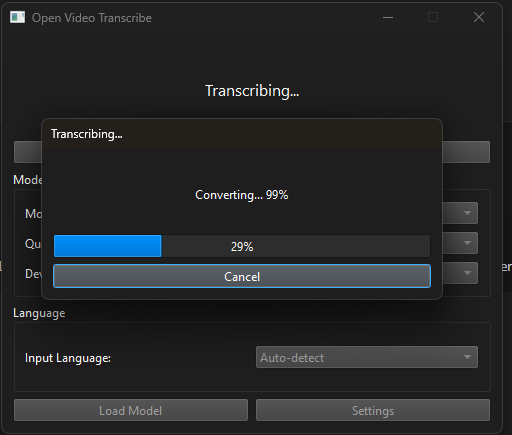

# Open Video Transcribe - User Guide

Complete guide for installing and using Open Video Transcribe.

## Quick Start

1. **Install**: Run `setup.bat` (Windows) or `./setup.sh` (Linux/macOS)
2. **Run**: Double-click `run.bat` or run `./run.sh`
3. **Load Model**: Select a model and click "Load Model"
4. **Transcribe**: Click "Select Video/Audio File" and choose your file
5. **Find Result**: Transcription is saved next to your input file with the same name

## Table of Contents

1. [Installation](#installation)
2. [First Time Setup](#first-time-setup)
3. [Using the Application](#using-the-application)
4. [Output File Location](#output-file-location)
5. [Configuration](#configuration)
6. [Troubleshooting](#troubleshooting)

## Installation

### Step 1: Prerequisites

Before installing, ensure you have:
- **Python 3.11 or 3.12** installed on your system
- **Internet connection** (for downloading dependencies and models)
- **NVIDIA GPU** (optional, for faster transcription with CUDA)

### Step 2: Download the Project

Clone or download the Open Video Transcribe repository to your computer.

### Step 3: Run Setup

#### Windows

1. Double-click `setup.bat` or run it from command prompt
2. The script will:
   - Detect installed Python versions
   - Let you choose which Python to use (auto-selects 3.11/3.12 if available)
   - Create a virtual environment
   - Download and install all dependencies
   - Download FFmpeg automatically (Windows only)
   - Generate starter scripts



#### Linux/macOS

1. Open terminal in the project directory
2. Run: `./setup.sh`
3. Or manually: `python install.py`

### Step 4: Verify Installation

After setup completes, you should see:
- `venv/` folder (virtual environment)
- `ffmpeg/` folder (Windows only, if auto-downloaded)
- `config.yaml` file (created automatically)

## First Time Setup

### 1. Configure FFmpeg Path

**Windows Users**: FFmpeg is automatically downloaded and configured during installation. You typically don't need to configure this manually.

**Linux/macOS Users** or if FFmpeg was not auto-detected:

1. Open the application (see [Running the Application](#running-the-application))
2. Click **Settings** button
3. Click **Browse...** next to FFmpeg Path
4. Navigate to your FFmpeg executable:
   - Windows: Usually in `ffmpeg\bin\ffmpeg.exe` (auto-downloaded) or `C:\ffmpeg\bin\ffmpeg.exe`
   - Linux: Usually `/usr/bin/ffmpeg`
   - macOS: Usually `/usr/local/bin/ffmpeg` or `/opt/homebrew/bin/ffmpeg`
5. Click **Save**

### 2. Load a Transcription Model

1. In the main window, select:
   - **Model**: Choose a Whisper model (e.g., `large-v3` for best quality)
   - **Quantization**: 
     - `float16` for GPU (faster, requires CUDA)
     - `float32` for CPU (slower but more compatible)
   - **Device**: `cuda` if you have NVIDIA GPU, otherwise `cpu`
2. Click **Load Model**

**Model Recommendations**:
- **Best Quality**: `large-v3` (slowest, best accuracy)
- **Balanced**: `medium` or `small`
- **Fast**: `base` or `tiny`

The first time you load a model, it will be downloaded from HuggingFace (this may take several minutes depending on your internet speed).

## Using the Application

### Basic Workflow

1. **Start the Application**
   - Windows: Double-click `run.bat`
   - Linux/macOS: Run `./run.sh` in terminal


2. **Select a File**
   - Click **Select Video/Audio File**
   - Choose a video file (MP4, AVI, MKV, etc.) or audio file (MP3, WAV, etc.)

3. **Wait for Processing**
   - The application will:
     - Convert video to audio (if video file)
     - Transcribe the audio
     - Save the transcription

4. **View Results**
   - A message will appear showing where the transcription was saved
   - The transcription file is saved in the **same directory** as your input file
   - The output file uses the **same name** as your input file with the format extension
   - Example: If you selected `my_video.mp4`, the output will be `my_video.txt` (or `.srt`/`.vtt` based on format)
   - Open the file to view your transcription

### Advanced Features

#### Language Selection

1. In the main window, use the **Input Language** dropdown
2. Select your language or choose **Auto-detect**
3. The model will use this language for transcription

#### Output Format

1. Click **Settings**
2. Choose output format:
   - **TXT**: Plain text file
   - **SRT**: Subtitle file (for video players)
   - **VTT**: WebVTT format (for web players)
3. Click **Save**

#### Changing Models

You can switch models at any time:
1. Select a different model from the dropdown
2. Adjust quantization and device if needed
3. Click **Load Model**
4. Wait for the new model to load

## Configuration

### Configuration File

Settings are stored in `config.yaml`. You can edit this file directly or use the Settings dialog in the application.

**Important settings**:

```yaml
ffmpeg_path: "C:/path/to/ffmpeg.exe"  # FFmpeg executable path (auto-set on Windows)
model:
  type: whisper                        # Model type
  name: large-v3                       # Model name
  quantization: float16                 # Quantization type
  device: cuda                         # Device (cpu/cuda)
languages:
  input: auto                          # Input language (auto-detect)
  output: en                           # Output language
output:
  format: txt                          # Output format (txt/srt/vtt)
  save_location: same_as_input         # Always saves next to input file
```

**Note**: The `save_location: same_as_input` setting means transcriptions are always saved in the same directory as your input file, with the same basename. This is the recommended and default behavior.

### Log Files

Log files are stored in the `logs/` directory. Each day gets a new log file:
- `transcriber_YYYYMMDD.log`

Check these files if you encounter errors or issues.

## Troubleshooting

### FFmpeg Not Found

**Symptoms**: Error message about FFmpeg not being found

**Solutions**:
1. Verify FFmpeg path in Settings
2. On Windows: FFmpeg should be downloaded automatically. If not, download from https://ffmpeg.org/download.html
3. On Linux: Install via package manager: `sudo apt install ffmpeg` (Ubuntu/Debian)
4. On macOS: Install via Homebrew: `brew install ffmpeg`

### Model Loading Fails

**Symptoms**: Error when loading model, or model download fails

**Solutions**:
1. Check internet connection (models download from HuggingFace)
2. Ensure sufficient disk space (models can be several GB)
3. Try a smaller model (e.g., `base` instead of `large-v3`)
4. Check firewall/antivirus isn't blocking downloads

### CUDA Errors

**Symptoms**: Errors about CUDA or GPU not available

**Solutions**:
1. Verify NVIDIA drivers are installed: `nvidia-smi` in terminal
2. Check PyTorch CUDA compatibility
3. Switch to CPU mode in Settings (change Device to `cpu`)
4. Reinstall PyTorch with CUDA support if needed

### Slow Transcription

**Solutions**:
1. Use GPU if available (select `cuda` device)
2. Use a smaller model (e.g., `small` instead of `large-v3`)
3. Use `float16` quantization on GPU
4. Close other applications to free up resources

### Application Won't Start

**Solutions**:
1. Verify Python 3.11 or 3.12 is installed
2. Check virtual environment exists: `venv/` folder should be present
3. Re-run `setup.bat` or `install.py`
4. Check log files in `logs/` directory for error messages

### Video Conversion Fails

**Symptoms**: Error converting video to audio

**Solutions**:
1. Verify FFmpeg path is correct in Settings
2. On Windows: Re-run `setup.bat` to re-download FFmpeg if needed
3. Check video file isn't corrupted
4. Try a different video format
5. Check FFmpeg version is recent enough
6. Verify you have write permissions in the video file's directory (for saving transcription)

## Tips and Best Practices

1. **Model Selection**:
   - Use `large-v3` for best accuracy (slowest)
   - Use `medium` for good balance
   - Use `base` or `small` for speed

2. **GPU Usage**:
   - Always use GPU (`cuda`) if available - much faster
   - Use `float16` quantization on GPU for best performance

3. **Language**:
   - Set language explicitly for better accuracy
   - Use "auto-detect" only if unsure

4. **File Formats**:
   - MP4 and WAV work best
   - Very large files may take a long time

5. **Output Formats**:
   - Use TXT for simple text
   - Use SRT for video subtitles
   - Use VTT for web players

6. **File Organization**:
   - Transcriptions are saved next to your source files automatically
   - This keeps your files organized and easy to find
   - Each transcription uses the same name as the source file

## Getting Help

If you encounter issues not covered here:

1. Check the log files in `logs/` directory
2. Review the [README.md](../README.md) troubleshooting section
3. Check the [AGENTS.md](../AGENTS.md) for technical details
4. Open an issue on the project repository

## Screenshots Reference

Screenshots are located in the `doc/screenshots/` folder:

- `setup-script.png` - Setup script running (Python version selection)
- `main-window.png` - Main application window with all controls

